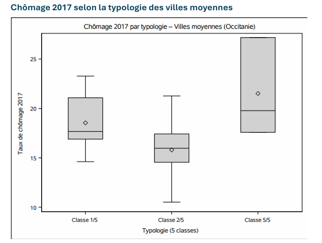

# 📊 Analyse des trajectoires démographiques, économiques et résidentielles des villes moyennes d'Occitanie avec SAS


---

# 📌 Présentation

Dans le cadre du cours de **Big Data / SAS** du Master 2 Analyse et Politique Économique (Université Lumière Lyon 2), ce projet consiste à réaliser une **analyse statistique descriptive** des trajectoires démographiques, économiques et résidentielles des **19 villes moyennes de la région Occitanie**.

L'objectif est d'identifier les facteurs expliquant les disparités territoriales en étudiant simultanément :

- la dynamique démographique ;
- le marché du travail ;
- l'attractivité résidentielle ;
- l'accessibilité aux grands pôles urbains.

Toutes les analyses ont été réalisées sous **SAS** à l'aide de procédures statistiques et graphiques.

---

# 🎯 Objectifs

- Nettoyer et préparer les données sous SAS
- Réaliser des statistiques descriptives
- Étudier les dynamiques démographiques
- Comparer les profils des villes selon leur typologie
- Identifier les facteurs associés aux situations de fragilité
- Produire des tableaux statistiques et des visualisations professionnelles

---

# 🗂 Jeu de données

**Source :**

- recherche.data.gouv.fr
- Base **typo_vm**
- Article *Espaces et Sociétés (2024)*

Population étudiée :

- **19 villes moyennes d'Occitanie**

Variables analysées :

- Population
- Chômage
- Solde naturel
- Solde migratoire
- Solde total
- Vacance des logements
- Accessibilité
- Indice de Gini
- Revenu disponible

---

# 🛠 Technologies utilisées

- SAS
- PROC SQL
- DATA Step
- PROC MEANS
- PROC FREQ
- PROC SGPLOT
- PROC CORR

---

# 📈 Analyses réalisées

## 1️⃣ Dynamique démographique

L'analyse montre que la croissance des villes moyennes repose principalement sur les migrations plutôt que sur le solde naturel.


---

## 2️⃣ Accessibilité et croissance démographique

Une meilleure proximité avec les grandes unités urbaines est généralement associée à des trajectoires démographiques plus favorables.


---

## 3️⃣ Chômage selon la typologie des villes

Les villes appartenant aux classes les plus fragiles présentent des niveaux de chômage plus élevés et une plus forte dispersion.



---

## 4️⃣ Vacance des logements

Les villes de la classe 1 présentent les taux de vacance résidentielle les plus importants.


---

## 5️⃣ Corrélations entre les principaux indicateurs

Une matrice de corrélation permet d'identifier les relations statistiques entre :

- chômage
- vacance
- soldes migratoires
- accessibilité
- dynamique démographique


---

## 6️⃣ Les villes les plus touchées par le chômage

Le classement met en évidence les villes cumulant les niveaux de chômage les plus élevés.


---

## 7️⃣ Les villes présentant la plus forte vacance résidentielle

Le classement des dix villes les plus concernées permet d'identifier les territoires les plus fragilisés.

%20.png)

---

# 📊 Principaux résultats

✔ La croissance démographique repose principalement sur les migrations.

✔ Les villes les plus éloignées des métropoles présentent souvent des trajectoires moins favorables.

✔ Les villes de la classe 1 concentrent les taux de chômage et de vacance résidentielle les plus élevés.

✔ L'accessibilité apparaît comme un facteur important de l'attractivité territoriale.

✔ Les analyses mettent en évidence une forte hétérogénéité entre les villes moyennes d'Occitanie.

---

# 💼 Compétences développées

- Analyse statistique
- SAS Programming
- Data Management
- Nettoyage des données
- Statistiques descriptives
- Analyse territoriale
- Corrélations
- Visualisation de données
- Interprétation économique
- Storytelling analytique

---

# 📂 Structure du dépôt

```text
analyse-villes-moyennes-occitanie-sas
│
├── README.md
├── CC_BDSAS25_DIALLOADOUM.sas
├── CC_BDSAS25_DIALLOADOUM.pdf
├── LICENSE
└── images/
    ├── Accessibilité vs dynamique.png
    ├── Boxplot Vacance.png
    ├── Boxplotchômage.png
    ├── Corrélations entre indicateurs clés.png
    ├── Les villes moyennes les plus touchées par le chômage en 2017.png
    ├── Nuage soldes naturel migratoire.jpeg
    └── Top 10 – Vacance des logements 2017 (VM Occitanie).png
```

---

# 📚 Références

- INSEE
- recherche.data.gouv.fr
- Espaces et Sociétés (2024)
- Base typo_vm

---

# 👨‍💻 Auteur

**Mamadou Pathé DIALLO**

🎓 Master 2 Analyse et Politique Économique – Université Lumière Lyon 2

📊 Data Analyst | Business Intelligence | Machine Learning | SAS | SQL | Power BI | Python | R

---

⭐ Si ce projet vous intéresse, n'hésitez pas à laisser une étoile au dépôt !
